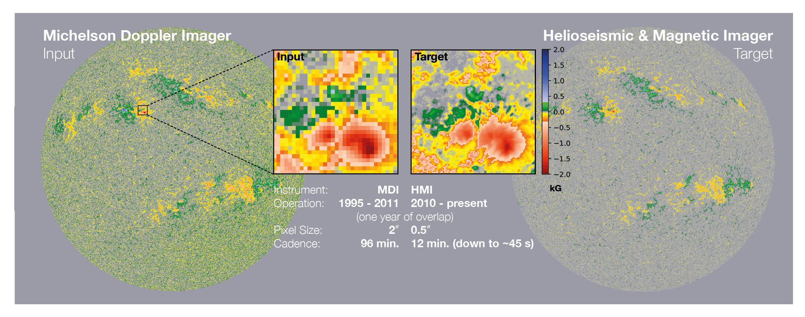

# SoHO/MDI & SDO/HMI Line-of-Sight Magnetogram Dataset
Co-aligned, co-temporal observations of the Sun's magnetic field, obtained from two space-based instruments.

### Overview

Over the last 20 years, full-disk observations of the Sun’s line-of-sight magnetic field have been by obtained from space by SoHO/MDI (1024 x 1024 pixels; 1996 - 2011), and SDO/HMI (4096 x 4096 pixels; 2010 - present). While combining these datasets would allow access to two solar cycles, differences between these instruments⁠—such as their orbits, resolution, noise, and saturation levels⁠—all introduce inhomogeneities and discontinuities that complicates analysis significantly. 

This curated dataset consists of co-aligned, co-temporal observations of the same physical structures as observed by HMI and MDI (rotated to the corresponding the HMI frame), as shown in Figure 1.

**Figure 1:** Co-temporal MDI and HMI magnetograms taken on the 31st March 2011. Further co-aligned patches are shown inset.

---

